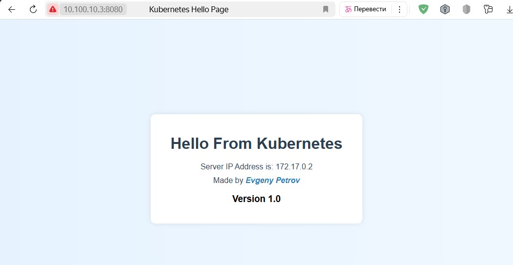

# Apache-PHP



`my-php-app` - является веб-страницей, которое отображает приветственное сообщение. Она выполняет следующие функции:

- Показывает заголовок "Hello From Kubernetes".
- Отображает IP-адрес сервера (контейнер), на котором запущено приложение, используя переменную.
- Отображает текущую версию приложения ("Version 1.0").
- Все версии образа имеют разный дизайн веб-страницы.

## Описание версий страниц

- **example-index.php** - пример-шаблон.
- **index-v1.0.php** — Базовая страница с выводом IP-адреса сервера и автором.
- **index-v1.1.php** — Изменён градиент фона, добавлен зелёный цвет для версии.
- **index-v1.2.php** — Новый градиент (жёлто-зелёный), версия 1.2.
- **index-v1.3.php** — Градиент красно-фиолетовый, версия 1.3.
- **index-v2.0.php** — Форма регистрации пользователя с подключением к PostgreSQL, обработка ошибок, стилизация.

## Инструкция по созданию Docker-образа

1. **Создайте Dockerfile** (пример в папках):

- `dockerfile-almalinux` - Dockerfile на основе almalinux.
- `dockerfile-alpine` - Dockerfile на основе alpine (образ будет в разы меньше чем на almalinux).

2. **Соберите образ:**

```sh
docker build -t petrovevgeny/my-php-app:v1.0 .
```

3. **Запустите контейнер:**

```sh
docker run --rm -d -p 8080:80 petrovevgeny/my-php-app:v1.0
```

- `-d`: запуск контейнера в фоновом режиме.
- `--rm`: удаление контейнера после его остановки.
- `-p`: проброс портов (host:docker).

4. **Откройте в браузере:**

`http://server-IP-address:8080`

---

> Для работы index-v2.0.php требуется доступный сервер PostgreSQL.