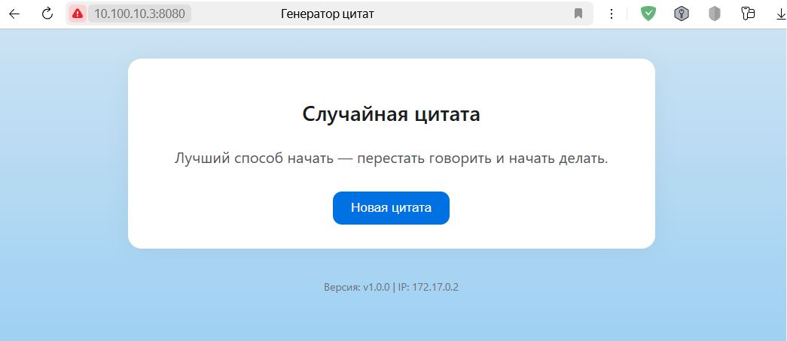

# Генератор случайных цитат



Простое веб-приложение на Go, которое отображает случайную цитату, версию приложения и IP-адрес сервера. Сборка и запуск осуществляются с помощью Docker.

## Структура проекта
- `main.go` — основной исходный код приложения на Go
- `index.html` — HTML-шаблон для отображения цитаты
- `styles.css` — стили для страницы
- `Dockerfile` — инструкция многоэтапной сборки контейнера

## Инструкция по созданию Docker-образа

1. **Создайте Dockerfile** (пример в текущей папке):


2. **Соберите образ:**

```sh
docker build -t petrovevgeny/my-go-app:v1.0.0 .
```

3. **Запустите контейнер:**

```sh
docker run --rm -d -p 8080:8080 petrovevgeny/my-go-app:v1.0.0
```

- `-d`: запуск контейнера в фоновом режиме.
- `--rm`: удаление контейнера после его остановки.
- `-p`: проброс портов (host:docker).

4. **Откройте в браузере:**

`http://server-IP-address:8080`
